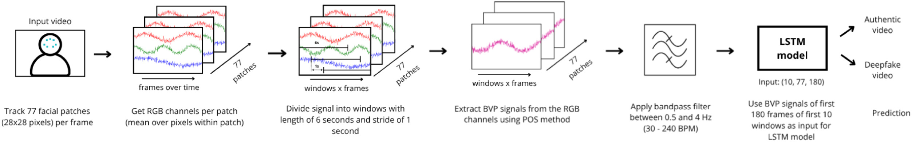

# rPPG-based Deepfake Detection

This repository contains the code for the article **“Do deepfakes have a heartbeat? Detecting deepfake videos using remote photoplethysmography”**, published in *Forensic Science International: Reports* (2026).

**Paper:** https://doi.org/10.1016/j.fsir.2026.100509  
**Dataset:** https://huggingface.co/datasets/NetherlandsForensicInstitute/rppg-deepfake-detection

This repository implements an end-to-end pipeline for investigating whether remote photoplethysmography (rPPG) signals extracted from portrait videos can be used for deepfake detection. rPPG estimates blood-volume-pulse (BVP) signals from subtle, temporally varying skin-color changes. The repository contains code for signal extraction, preprocessing, model training and evaluation, generalization experiments, baseline comparisons, and validation of extracted heart-rate signals against reference measurements.

We evaluated the method on both manipulated face videos and fully AI-generated videos. Importantly, the method should not be interpreted as a simple “heartbeat present = real, heartbeat absent = fake” test: extracted rPPG signals can contain genuine heart-rate information, while their reliability and discriminative value depend on the video content and acquisition conditions.

> **Research-use notice**  
> This repository contains experimental research software. It is intended to support reproducibility and further research, not to provide a stand-alone forensic decision system.

## Repository structure

```text
extraction/            Video → BVP signal extraction and NDJSON post-processing
src/                   Shared library code: model, metrics, features, filters, datasets
analysis/              Stand-alone plotting and analysis scripts
train.py               Train the LSTM classifier on one train/evaluation split
cv_train.py            K-fold or repeated-split cross-validation
loo_generalization.py  Leave-one-generator-out generalization evaluation
baseline_train.py      Non-LSTM baselines over handcrafted features
predict.py             Inference with a trained model, optionally with evaluation
```

## Installation

### Requirements

The code was developed for **Python 3.10**. Standard Python dependencies are managed with [pdm](https://pdm-project.org/) through `pyproject.toml`. The GPU-based rPPG extraction stack additionally depends on CUDA, CuPy, cuSignal, and pyVHR, which require a conda-backed environment and/or installation from source.

### 1. Create the conda environment

```bash
conda create -n rppg-paper python=3.10
conda activate rppg-paper
conda install -c conda-forge cudatoolkit=12.3
```

### 2. Configure pdm to use the conda interpreter

Run this from the repository root:

```bash
pdm use -f "$(conda info --base)/envs/rppg-paper/bin/python"
```

This makes `pdm run` and `pdm install` use the conda environment directly rather than creating a separate virtual environment.

### 3. Install the Python dependencies

```bash
pdm install
```

If dependency resolution fails against a restricted or mirrored package index, install the synchronized requirements file instead:

```bash
pdm run pip install -r requirements.txt
```

### 4. Install CuPy

Install the CuPy build that matches the local CUDA installation, for example:

```bash
pdm run pip install cupy-cuda12x
```

### 5. Install cuSignal

cuSignal is installed from source:

```bash
git clone -b branch-23.10 https://github.com/rapidsai/cusignal.git
pdm run pip install ./cusignal/python
```

### 6. Install pyVHR

```bash
git clone https://github.com/phuselab/pyVHR.git
```

For the pyVHR version used in this project, `pyVHR/BPM/BPM.py` requires a small compatibility patch: comment out line 8, which imports multiple functions with the same name and can otherwise cause an import failure. Then install the package:

```bash
pdm run pip install ./pyVHR
```

### 7. Run commands through pdm

Use `pdm run` for all project scripts so that the configured environment is used consistently:

```bash
pdm run train.py --data signals.ndjson
```

## Dataset and data format

The original videos used in the experiments are available from the accompanying Hugging Face dataset:

https://huggingface.co/datasets/NetherlandsForensicInstitute/rppg-deepfake-detection

Intermediate and processed data are stored as **NDJSON** files, with one JSON object per video. A typical record contains:

| Field | Description |
|---|---|
| `BVPS` | Extracted BVP signal. This is either a nested array or a dictionary keyed by facial region when `--per-region` is enabled. |
| `Type` | Source or label identifier, e.g. `original`, `Deepfakes`, `NeuralTextures`. |
| `Filename` | Path or identifier of the source video. |
| `FPS` | Frame rate used during signal extraction. |
| `BPM` / `BPMES` | Estimated heart rate, when `--calc-bpm` is enabled. |
| `Uncertainty` | Per-window BPM uncertainty, when `--calc-bpm` is enabled. |
| `SNR` | Per-window rPPG signal-to-noise ratio in dB, when `--calc-bpm` is enabled. |

Training labels are assigned through `load_and_label()` in `train.py`. An explicit list of real
classes must be provided with `--real-types` in the training and evaluation scripts; every other
`Type` value is treated as fake. `Screen`, `Mannequin`, and `Paper` no-pulse controls are always
excluded.

## Reproducing the experimental pipeline

The project is organized so that the main stages of the study can be run independently. Most scripts expose additional options through `--help`.

### 1. Extract rPPG/BVP signals

`extraction/extract_signals.py` uses pyVHR to extract RGB traces from facial landmark patches, divide the traces into temporal windows, and convert them into BVP signals.

```bash
pdm run extraction/extract_signals.py \
    --dataset <name> \
    --dataset-dir <path> \
    --method pos \
    [--calc-bpm] \
    [--per-region] \
    [--bg-subtract]
```

Supported dataset identifiers include:

- `ubfc1`, `ubfc2`;
- `ground-truth`;
- arbitrary datasets following the generic `<authenticity>/<source>/<video>` directory layout.

Supported rPPG methods are defined by `SUPPORTED_METHODS` in the extraction script:

```text
green, pos, omit, chrom
```

Useful extraction options:

- `--calc-bpm`: estimate BPM, uncertainty, and SNR for each window;
- `--per-region`: retain separate signals for individual facial regions;
- `--bg-subtract`: subtract FFT-domain background illumination before BVP estimation.

### 2. Post-process extracted signals

`extraction/extract_signals.py` writes out the raw (unfiltered) BVP signal. Bandpass-filtering
to the 0.5-4 Hz physiological band is a **separate, required step to reproduce the paper's main
deepfake-detection results** (Table 3 / Table 6's "0.5-4 Hz bandpass filter" row) — training on
the unfiltered signal instead reproduces the "Unfiltered" ablation row, which is a different
(higher-accuracy, less physiologically-grounded) result. Filtering is kept as a separate step
rather than baked into extraction because the unfiltered signal is also what the ground-truth
heart-rate validation experiments (`analysis/calculate_rppg_accuracy*.py`) consume:

```bash
pdm run extraction/filter_signals.py signals.ndjson [out.ndjson] --band bandpass
pdm run extraction/split_dataset.py --data signals.ndjson [--split-val]
```

`split_dataset.py` mirrors the splitting logic used by the training pipeline so that generated train/validation/test files can be passed directly to the model scripts.

### 3. Train and evaluate the LSTM detector

Single train/evaluation split:

```bash
pdm run train.py --data signals.ndjson [--eval-data test.ndjson] [--tune]
```

Cross-validation / repeated splits:

```bash
pdm run cv_train.py --data signals.ndjson --mode repeated
```

or:

```bash
pdm run cv_train.py --data signals.ndjson --mode k-fold --folds 5
```

Important `train.py` options include:

- `--tune`: run Keras Tuner rather than the fixed model configuration;
- `--num-windows` and `--num-frames`: control the fixed input tensor dimensions;
- `--real-types`: comma-separated `Type` values to treat as real (required);
- `--no-class-weights`: disable class weighting.

The training script writes learning curves and per-sample predictions to `--output-dir` (default: `results/`).

### 4. Evaluate generalization to unseen generators

```bash
pdm run loo_generalization.py --data signals.ndjson --real-types youtube
```

For each fake-generator type, the script trains on the remaining types and evaluates on the held-out generator. This experiment measures generalization beyond the manipulation/generation methods observed during training.

Outputs are written to `results_loo/` by default, including:

```text
fold_results.csv
per_type_results.csv
per_generator_summary.csv
```

### 5. Run non-LSTM baselines and ablations

```bash
pdm run baseline_train.py \
    --data signals.ndjson \
    --real-types youtube \
    --feature-set <handcrafted|bpm|snr|spatial-coherence|image-compression>
```

The baseline implementation uses logistic regression over features from `src/features.py`. It follows the same cross-validation and metric aggregation code as the LSTM experiments, which makes the results directly comparable.

The available feature sets support experiments on:

- estimated heart-rate statistics;
- signal-to-noise characteristics;
- general spectral/morphological BVP features;
- cross-region spatial coherence;
- image-compression-related features.

### 6. Run inference with a trained model

```bash
pdm run predict.py \
    --model results/LSTM.keras \
    --data signals.ndjson \
    [--evaluate --real-types youtube]
```

With `--evaluate`, the input data must have ground-truth labels and `--real-types` is required. The script then also writes evaluation plots and per-type metrics to `--output-dir` (default: `predictions/`).

### 7. Validate rPPG extraction against heart-rate ground truth

The `analysis/` directory contains the scripts used to compare estimated BPM values with external heart-rate measurements:

- `calculate_rppg_accuracy.py`;
- `calculate_rppg_accuracy_UBFC.py`;
- `analyze_rppg_accuracy.py`.

These analyses are separate from deepfake classification and are intended to determine whether the extracted rPPG signals correspond to independently measured heart-rate information.

## Model architecture



The main classifier is implemented in `src/model.py` as a two-input Keras model:

1. a BVP tensor with shape `(timesteps, num_frames, num_features)`;
2. a boolean `window_mask` with shape `(timesteps,)`.

The network consists of:

```text
per-window TimeDistributed(Conv1D) feature extraction
    ↓
SpatialDropout1D
    ↓
stacked Bidirectional LSTM layers
    ↓
sigmoid output
```

The window mask is passed explicitly to the LSTM layers. This prevents padded windows, which are introduced to represent videos of different durations in a fixed-size tensor, from becoming a shortcut for classification.

`reshape_bvp()` implements the shared BVP-to-tensor conversion and is used consistently by `train.py`, `cv_train.py`, `loo_generalization.py`, and `predict.py`.

## Shared evaluation and feature code

### `src/evaluation.py`

Contains metric and confidence-interval utilities shared across the LSTM and baseline experiments. The common implementation keeps reporting consistent across experimental variants and supports aggregated per-type analyses.

Relevant functions include:

```text
compute_metrics
ci / bootstrap_ci
find_threshold
aggregate_subset
```

### `src/features.py`

Implements the handcrafted features used by `baseline_train.py`, including heart-rate, SNR, spectral/morphological BVP, spatial-coherence, and compression-related features.

### `src/filter.py`

Implements Butterworth band-pass, band-stop, low-pass, and high-pass filtering. These filters are used for experiments that isolate or remove the physiological heart-rate band and thereby test which frequency components contribute to classification.

### `src/datasets/`

Contains the repository's lightweight dataset abstraction. `FileVideoDataset` implements the generic `<authenticity>/<source>/<video>` on-disk layout, while `extraction/load_dataset.py` maps dataset names to the corresponding loader.

## Analysis scripts and generated outputs

The scripts in `analysis/` consume CSV or NDJSON results and are not imported by the training pipeline.

| Script | Purpose |
|---|---|
| `plot_cv_results.py` | Plot per-type cross-validation results. |
| `plot_loo_results.py` | Plot leave-one-generator-out results. |
| `calculate_rppg_accuracy.py` | Compare estimated BPM with Garmin/Movesense ground truth. |
| `calculate_rppg_accuracy_UBFC.py` | Compare estimated BPM with UBFC ground truth. |
| `analyze_rppg_accuracy.py` | Analyze and plot rPPG accuracy statistics. |
| `analyze_predictions.py` | Additional prediction diagnostics. |
| `video_duration_distribution.py` | Analyze video-duration distributions. |

`plot_rppg_accuracy.py` and `videos_without_living.py` contain machine-specific paths and should be treated as one-off analysis/reference scripts rather than portable command-line tools.

## Known environment issue: `libstdc++` / SciPy import order

In the development environment, importing `pandas` first can load a system `libstdc++.so.6` that is older than the version required by compiled SciPy extensions (including dependencies imported through scikit-learn). This can cause an error such as:

```text
ImportError: ... version 'CXXABI_1.3.15' not found
```

Once a shared library has been loaded into the Python process, later changes to `sys.path` or `rpath` do not replace it. The working solution in this environment is therefore to import packages that load SciPy/scikit-learn **before** importing `pandas`.

The repository entry points (`train.py`, `cv_train.py`, `loo_generalization.py`, `baseline_train.py`, and `predict.py`) already follow this import order. Keep this in mind when adding new scripts or reorganizing imports.

## Citation

If you use this repository or the accompanying dataset in academic work, please cite:

> **Do deepfakes have a heartbeat? Detecting deepfake videos using remote photoplethysmography.**  
> *Forensic Science International: Reports*, 2026, article 100509.  
> https://doi.org/10.1016/j.fsir.2026.100509

```bibtex
@article{rppg_deepfake_detection_2026,
title = {Do deepfakes have a heartbeat? Detecting deepfake videos using remote photoplethysmography},
journal = {Forensic Science International: Reports},
volume = {14},
pages = {100509},
year = {2026},
issn = {2665-9107},
doi = {https://doi.org/10.1016/j.fsir.2026.100509},
url = {https://www.sciencedirect.com/science/article/pii/S2665910726000617},
author = {Stijn {van Lierop} and Sanne {de Wit} and Paula Pronk and Zeno Geradts},
keywords = {Deepfake detection, AI-generated video, Remote photoplethysmography, Forensic video analysis, Explainable AI},
abstract = {With the rapid advancements in generative video models it has become possible to manipulate and generate hyperrealistic videos. So-called deepfakes can be used to facilitate crimes and falsify evidence, thereby undermining public trust in the justice system. This necessitates the development of reliable methods for the authentication of digital media in forensic practice. Among the many strategies explored in the literature, remote photoplethysmography (rPPG)-based detection methods represent a promising direction. These methods assess authenticity based on blood volume pulse signals estimated from a video and have demonstrated robust performance based on physiologically interpretable features. However, it remains unclear whether rPPG signals utilized by detection methods actually correspond to the real-life heart rate. In this study, we introduce a simple approach that detects deepfakes by analyzing rPPG signals obtained from portrait videos, and we investigate whether these signals truly reflect heart rate through a series of ground-truth experiments. Furthermore, where existing methods focused on faceswap videos only, we extend our evaluation to also include fully AI-generated videos created by state-of-the-art, commercial text-to-video models. Results demonstrate that rPPG signals can be informative for detecting both faceswap as well as fully AI-generated videos. We find that ground-truth heart rate can be estimated from rPPG signals, although the accuracy of these estimates varies substantially with dataset characteristics and acquisition conditions, such as environmental lighting and camera specifications. Future work should therefore investigate the reliability of rPPG analysis on a large forensically relevant ground-truth dataset to assess its applicability in a variety of challenging case conditions.}
}
```
